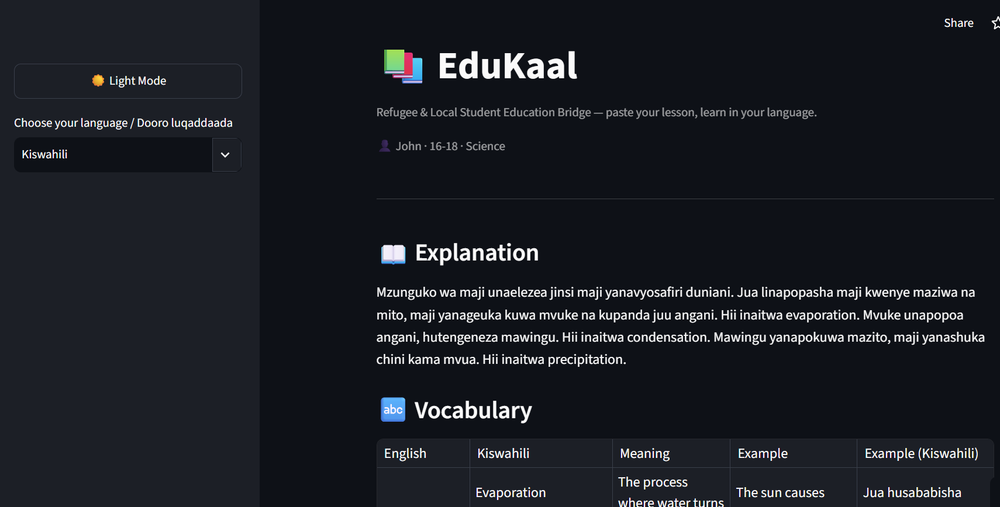
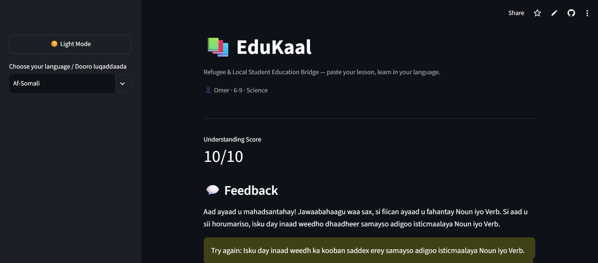
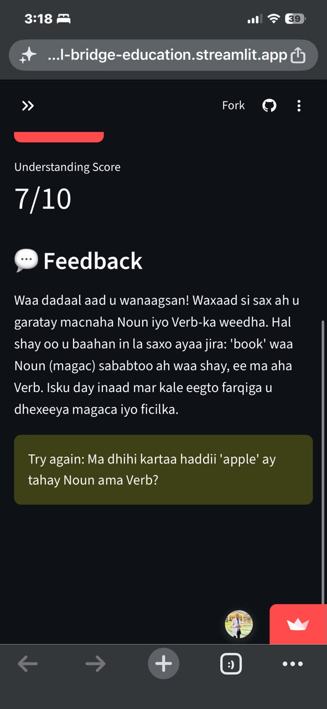

# 📚 EduKaal — Refugee & Local Student Education Bridge

Built for the **Build with Gemma Hackathon** (GDG on Campus Makerere) — Track: **AI for Education**

EduKaal is a bilingual AI tutor that helps refugee and local students in Uganda understand
English-based school lessons in their own language, while still learning the English academic
vocabulary they need for exams — using Google's Gemma model.

## Demo



*Live Kiswahili lesson — explanation, vocabulary table, and quiz.*



*Live Af-Somali lesson output.*



*Tested on mobile — real student feedback and understanding score, live.*

## The Problem

Uganda hosts **nearly 2 million refugees and asylum-seekers** — the largest refugee
population in Africa, and still growing. By October 2025, the total stood at approximately
1.95 million ([Wikipedia, citing UNHCR/OPM data](https://en.wikipedia.org/wiki/Refugees_in_Uganda)),
and UNHCR has reported an average of **600 new arrivals per day** from Sudan, South Sudan,
and the DRC ([UN press briefing, 2025](https://press.un.org/en/uganda)). The majority come
from **South Sudan (~55%) and the Democratic Republic of the Congo (~31%)**
([UNHCR](https://www.unhcr.org/where-we-work/countries/uganda)).
Alongside local Ugandan students, many of these students study a curriculum delivered
entirely in English, which is often not their first language. Struggling with the language
of instruction can mean struggling with the subject itself, even when the student
understands the underlying concept perfectly well in their mother tongue.

EduKaal is a step toward closing that gap. The current prototype supports **Af-Somali,
Kiswahili, and Arabic** — languages spoken by refugee communities already present in
Uganda's settlements. The clear next step, informed directly by the population data above,
is extending support to the **South Sudanese and Congolese languages** spoken by the two
largest refugee groups in the country (e.g. Dinka, Nuer, Bari, Lingala, and Congolese
Swahili), so the tool reaches the students who need it most.

## How EduKaal Helps

A student pastes or uploads a lesson (PDF, Word document, photo, or plain text), selects
their language, and EduKaal:

1. **Explains** the core concept in their language (Af-Somali, Kiswahili, or Arabic —
   Luganda support is in progress, see Language Testing below)
2. **Teaches** 3 key academic English words from the lesson — kept in English (since that's
   what appears on exams) with a natural explanation in the student's language
3. **Evaluates** understanding with 3 questions, then scores the student's answers with
   encouraging, native-language feedback

## Tech Stack

- **Model:** Gemma 4 26B A4B (`gemma-4-26b-a4b-it`) via Google AI Studio / `google-genai` SDK
- **UI:** Streamlit
- **File support:** PDF (`pypdf`), Word (`python-docx`), image OCR (`pytesseract` + Tesseract)
- **Language:** Python

## Architecture

```
Student → Streamlit UI (app.py) → get_tutor_response() → Gemma API → back
```

- `agent.py` — wraps the Gemma API call, strips markdown fences, parses JSON, and returns a
  clean Python dict (with a graceful error fallback if the model's output isn't valid JSON)
- `app.py` — the Streamlit interface: language selector, file upload, lesson/quiz display
- `system_instruction.txt` — the tutor's full behavior contract, including a strict two-mode
  JSON schema (`lesson` for explaining, `feedback` for scoring answers)

## Why a Strict JSON Schema

Gemma's response is parsed directly into the UI, so every response must be valid, predictable
JSON with no exceptions — even for greetings or off-topic input. The system instruction defines
two response modes and forbids plain conversational replies entirely.

## Language Testing

Each supported language was manually tested against the same lesson (the water cycle) before
being included in the demo:

| Language   | Result |
|------------|--------|
| Af-Somali  | ✅ Passed — accurate, natural translation |
| Kiswahili  | ✅ Passed — accurate, natural translation |
| Arabic     | ✅ Passed — accurate translation, correct right-to-left rendering throughout |
| Luganda    | 🔶 Improving, not yet fully supported — the English-term-with-bracket rule fixed the fluency issues and fabricated filler from the first test, but a couple of vocabulary choices still need native-speaker confirmation before this moves out of roadmap status |

This is a known limitation of low-resource language coverage in smaller open models, not a
prompt engineering issue — no instruction can substitute for training data the model doesn't have.

## Scientific/Academic Terms

Through testing, we found the model handled academic vocabulary most reliably when it kept
the **English term** (e.g. "Evaporation") and explained it in the student's language in
brackets, rather than attempting a native-language scientific term. This is also
pedagogically correct: students are examined in English, so the English term is what needs
to stick.

## Known Limitations & Roadmap

- **Diagram-based lessons** (Venn diagrams, geometry figures, maps) are not well supported —
  OCR reads printed text, not the meaning inside a hand-drawn figure. This would require
  multimodal image understanding rather than OCR-then-text, and is a roadmap item.
- **Scanned/photographed PDFs** with no embedded text layer will not extract — the app
  detects this and prompts the student to try a photo or paste text instead.
- **Luganda** translation quality needs further validation before being demo-ready.

## Running Locally

```bash
python -m venv .venv
source .venv/Scripts/activate      # or .venv\Scripts\Activate.ps1 on PowerShell
pip install -r requirements.txt
```

Create a `.env` file with your Google AI Studio API key:
```
GEMINI_API_KEY=your_key_here
```

If using image upload on Windows, install
[Tesseract OCR](https://github.com/UB-Mannheim/tesseract/wiki) and confirm the path in `app.py`
matches your install location.

```bash
streamlit run app.py
```

## Team / Contact

Built by Abdirahman Tayib Omer founder of Kaaltra AI Training Hub.
Contact: Abdirahman.Kaalmeeye2030@gmail.com